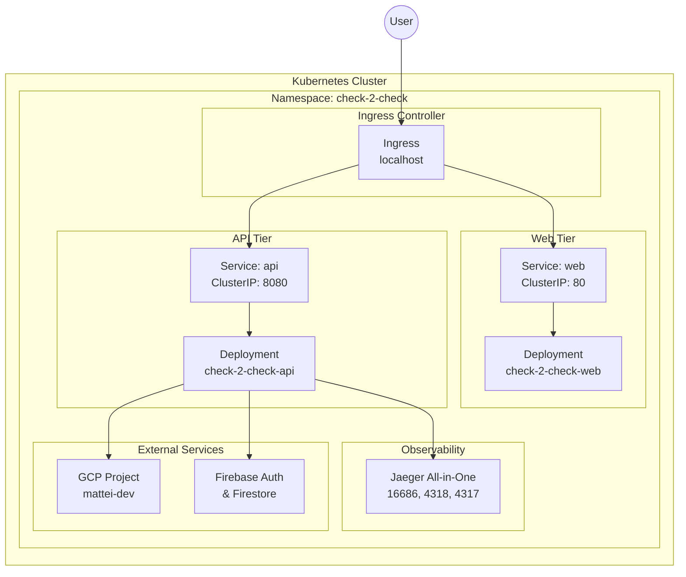

import { Tabs, TabItem } from '@astrojs/starlight/components';

## Overview

The Check-2-Check application runs on a Kubernetes cluster with the following components:



## Namespace

<Tabs>
<TabItem label="YAML">

```yaml
# k8s/namespace.yaml
apiVersion: v1
kind: Namespace
metadata:
  name: check-2-check
  labels:
    name: check-2-check
```

</TabItem>
</Tabs>

---

## Web Tier (Flutter Frontend)

### Deployment

<Tabs>
<TabItem label="YAML">

```yaml
# k8s/web-deployment.yaml
apiVersion: apps/v1
kind: Deployment
metadata:
  name: web
  namespace: check-2-check
spec:
  replicas: 1
  selector:
    matchLabels:
      app: web
  template:
    metadata:
      labels:
        app: web
    spec:
      containers:
        - name: web
          image: check-2-check-web:latest
          imagePullPolicy: Never
          ports:
            - containerPort: 80
          resources:
            requests:
              memory: "64Mi"
              cpu: "50m"
            limits:
              memory: "128Mi"
              cpu: "100m"
```

</TabItem>
</Tabs>

### Service

<Tabs>
<TabItem label="YAML">

```yaml
# k8s/web-service.yaml
apiVersion: v1
kind: Service
metadata:
  name: web
  namespace: check-2-check
spec:
  selector:
    app: web
  ports:
    - port: 80
      targetPort: 80
  type: ClusterIP
```

</TabItem>
</Tabs>

---

## API Tier (Quarkus Backend)

### Deployment

<Tabs>
<TabItem label="YAML">

```yaml
# k8s/api-deployment.yaml
apiVersion: apps/v1
kind: Deployment
metadata:
  name: api
  namespace: check-2-check
spec:
  replicas: 1
  selector:
    matchLabels:
      app: api
  template:
    metadata:
      labels:
        app: api
    spec:
      containers:
        - name: api
          image: check-2-check-api:latest
          imagePullPolicy: Never
          ports:
            - containerPort: 8080
          env:
            - name: GCP_PROJECT_ID
              valueFrom:
                configMapKeyRef:
                  name: api-config
                  key: gcp_project_id
            - name: GOOGLE_APPLICATION_CREDENTIALS
              value: "/var/run/secrets/gcp/credentials.json"
            - name: QUARKUS_OTEL_EXPORTER_OTLP_ENDPOINT
              value: "http://jaeger:4318"
            - name: OTEL_SERVICE_NAME
              value: "check-2-check-api"
          volumeMounts:
            - name: gcp-credentials
              mountPath: /var/run/secrets/gcp
            - name: firebase-creds
              mountPath: /var/run/secrets/firebase
      volumes:
        - name: gcp-credentials
          secret:
            secretName: gcp-credentials
            optional: true
        - name: firebase-creds
          secret:
            secretName: firebase-credentials
            optional: true
```

</TabItem>
</Tabs>

### Service

<Tabs>
<TabItem label="YAML">

```yaml
# k8s/api-service.yaml
apiVersion: v1
kind: Service
metadata:
  name: api
  namespace: check-2-check
spec:
  selector:
    app: api
  ports:
    - port: 8080
      targetPort: 8080
  type: ClusterIP
```

</TabItem>
</Tabs>

### ConfigMap

<Tabs>
<TabItem label="YAML">

```yaml
# k8s/configmap.yaml
apiVersion: v1
kind: ConfigMap
metadata:
  name: api-config
  namespace: check-2-check
data:
  gcp_project_id: "mattei-dev"
```

</TabItem>
</Tabs>

---

## Ingress (Routing)

<Tabs>
<TabItem label="YAML">

```yaml
# k8s/ingress.yaml
apiVersion: networking.k8s.io/v1
kind: Ingress
metadata:
  name: check-2-check-ingress
  namespace: check-2-check
  annotations:
    nginx.ingress.kubernetes.io/proxy-body-size: "10m"
    nginx.ingress.kubernetes.io/proxy-read-timeout: "30"
spec:
  rules:
    - host: localhost
      http:
        paths:
          - path: /api
            pathType: Prefix
            backend:
              service:
                name: api
                port:
                  number: 8080
          - path: /
            pathType: Prefix
            backend:
              service:
                name: web
                port:
                  number: 80
```

</TabItem>
</Tabs>

---

## Observability (Jaeger)

### Deployment

<Tabs>
<TabItem label="YAML">

```yaml
# k8s/jaeger-deployment.yaml
apiVersion: apps/v1
kind: Deployment
metadata:
  name: jaeger
  namespace: check-2-check
spec:
  replicas: 1
  selector:
    matchLabels:
      app: jaeger
  template:
    metadata:
      labels:
        app: jaeger
    spec:
      containers:
        - name: jaeger
          image: jaegertracing/all-in-one:latest
          ports:
            - containerPort: 16686  # UI
            - containerPort: 4318   # OTLP HTTP
            - containerPort: 4317   # OTLP gRPC
          env:
            - name: COLLECTOR_OTLP_ENABLED
              value: "true"
            - name: LOG_LEVEL
              value: debug
```

</TabItem>
</Tabs>

### Service

<Tabs>
<TabItem label="YAML">

```yaml
# k8s/jaeger-service.yaml
apiVersion: v1
kind: Service
metadata:
  name: jaeger
  namespace: check-2-check
spec:
  selector:
    app: jaeger
  ports:
    - name: ui
      port: 16686
      targetPort: 16686
    - name: otlp-http
      port: 4318
      targetPort: 4318
    - name: otlp-grpc
      port: 4317
      targetPort: 4317
```

</TabItem>
</Tabs>

---

## Traffic Flow

| Step | Component | Description |
|------|-----------|-------------|
| 1 | User | Requests hit `localhost` |
| 2 | Ingress | Routes `/api/*` to API service, `/` to Web service |
| 3 | Web Service | Routes to Web pod on port 80 |
| 4 | Web Pod | Serves Flutter static files |
| 5 | API Service | Routes to API pod on port 8080 |
| 6 | API Pod | Quarkus backend processes requests |
| 7 | External | API connects to GCP Firebase/Firestore |
| 8 | Tracing | API sends OTLP traces to Jaeger |

## Resource Summary

| Component | Replicas | CPU Request | Memory Request |
|-----------|----------|-------------|----------------|
| web | 1 | 50m | 64Mi |
| api | 1 | 250m | 256Mi |
| jaeger | 1 | 100m | 256Mi |