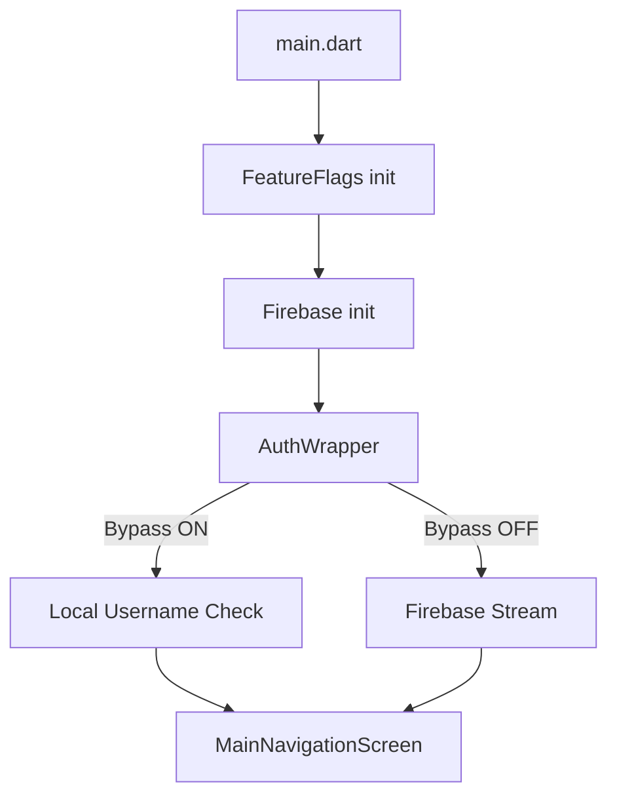

Check-2-Check is a cross-platform Flutter application built for income-based budgeting.

## High-Level Tech Stack

- **Framework**: [Flutter](https://flutter.dev/) (Dart)
- **Backend/Auth**: [Firebase](https://firebase.google.com/)
- **Local Persistence**: [SharedPreferences](https://pub.dev/packages/shared_preferences)
- **State Pattern**: Service-oriented with `StreamBuilder` over Firebase and `FutureBuilder` over local preferences.

## Core System Flow

1.  **Boot Phase**: Initialize `FeatureFlags` from `SharedPreferences`. Initialize `Firebase`.
2.  **Auth Wrapper**:
    -   If `enableUsernameOnlyLogin` flag is on: Check local username.
    -   Else: Listen to the Firebase `authStateChanges` stream.
3.  **App Phase**: Route to `MainNavigationScreen` (if flag is on) or `CalendarScreen`.

## Diagram (Mermaid)

